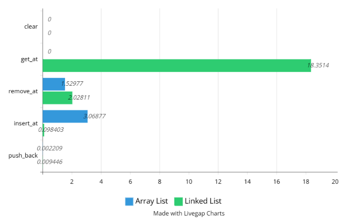

# vetor-dinamico
Trabalho feito para a disciplina de Algoritmos - Análise e desenvolvimento de Sistemas IFRN

# Array List

Essa classe é voltada para a criação de um array utilizando **alocação dinâmica**, onde o usuário pode adicionar, remover e acessar os elementos do array.

> A alocação dinâmica é o processo de reservar memória em tempo de execução, permitindo que o tamanho da memória alocada seja ajustado conforme a necessidade do programa. 

## Métodos

- Construtor
```
public:array_list() {
  this-> size_ = 0;
  this-> capacity_ = 8;
  this-> data = new int[capacity_];
}
```

O construtor da classe é responsável por inicializar os atributos da classe. Ele define o tamanho inicial do array (`size_`) como 0, a capacidade inicial (`capacity_`) como 8 e aloca dinamicamente um array de inteiros com essa capacidade.

<br>
<br>
<br>

- Destrutor
```
~array_list() {
  delete[] data;
}

```
O destrutor é responsável por liberar a memória alocada dinamicamente para o array `data` quando o objeto é destruído.

<br>
<br>
<br>

- increase_capacity

```
void increase_capacity() {
  capacity_ *= 2;
  int *new_node = new int[capacity_];

  for (unsigned int i = 0; i < size_; ++i) {
    new_node[i] = data[i];
  }

  delete[] data;
  data = new_node;
}
```

O método `increase_capacity` é responsável por aumentar a capacidade do array quando necessário. Ele duplica a capacidade atual (`capacity_`), aloca um novo array com a nova capacidade, copia os elementos do array antigo para o novo array e, finalmente, libera a memória do array antigo e atualiza o ponteiro `data` para apontar para o novo array.

<br>
<br>
<br>

- size

```
unsigned int size() {
  return size_;
}
```

O método `size` retorna o tamanho atual do array, que é armazenado no atributo `size_`.

<br>
<br>
<br>

- capacity

```
unsigned int capacity() {
  return capacity_;
}
```

O método `capacity` retorna a capacidade atual do array, que é armazenada no atributo `capacity_`.

<br>
<br>
<br>

- percent_occupied

```
double percent_occupied() {
   return (static_cast<double>(size_) / static_cast<double>(capacity_)) * 100;
}
```

O método `percent_occupied` calcula e retorna a porcentagem de ocupação do array. Ele divide o tamanho atual (`size_`) pela capacidade atual (`capacity_`) e multiplica o resultado por 100 para obter o percentual de ocupação. O uso de `static_cast<double>` é necessário para garantir que a divisão seja realizada em ponto flutuante, evitando a perda de precisão.

<br>
<br>
<br>

- insert_at

```
bool insert_at(unsigned int index, int value) {
  if(index > size_) {
    return false;
  }

  if(size_ == capacity_) {
    increase_capacity();
  }

  for(std::size_t i = size_; i > index; --i) {
    data[i] = data[i - 1];
  }

  data[index] = value;
  ++size_;
  return true;
}
```

O método `insert_at` insere um valor em uma posição específica do array. Ele verifica se o índice fornecido é válido (menor ou igual ao tamanho atual do array). Se o índice for inválido, o método retorna `false`.

Se o array estiver cheio (tamanho igual à capacidade), o método `increase_capacity` é chamado para aumentar a capacidade do array.

Em seguida, o método move todos os elementos a partir do índice fornecido uma posição para a direita para abrir espaço para o novo valor.
Finalmente, o novo valor é inserido na posição especificada, o tamanho do array é incrementado e o método retorna `true`.

<br>
<br>
<br>

- remove_at

```
bool remove_at(unsigned int index) {
  if(index > size_) {
    return false;
  }

  for(std::size_t i = index; i < size_ - 1; ++i) {
    data[i] = data[i + 1];
  }
    
  --size_;
  return true;
}
```

O método `remove_at` remove um valor em uma posição específica do array. Ele verifica se o índice fornecido é válido (menor que o tamanho atual do array). Se o índice for inválido, o método retorna `false`.

Se o índice for válido, o método move todos os elementos a partir do índice fornecido uma posição para a esquerda para preencher o espaço deixado pelo valor removido.

Finalmente, o tamanho do array é decrementado e o método retorna `true`.

<br>
<br>
<br>

- get_at

```
int get_at(unsigned int index) {
  if(index > size_) {
    return -1;
  }

  return data[index];
}
```

O método `get_at` retorna o valor em uma posição específica do array. Ele verifica se o índice fornecido é válido (menor que o tamanho atual do array). Se o índice for inválido, o método retorna `-1`.

Se o índice for válido, o método retorna o valor na posição especificada.

<br>
<br>
<br>

- clear

```
void clear() {
  size_ = 0;
  capacity_ = 8;
  data = new int[capacity_];
}
```

O método `clear` redefine o tamanho do array para `0` e a capacidade para `8`. Em seguida, ele aloca um novo array de inteiros com a capacidade inicial de `8` elementos.

<br>
<br>
<br>

- push_back

```
void push_back(int value) {
  if(size_ == capacity_) {
    increase_capacity();
  }

  data[size_] = value;
  ++size_;
}
```

O método `push_back` adiciona um novo valor ao final do array. Ele verifica se o tamanho atual do array é igual à sua capacidade. Se for, ele chama o método `increase_capacity` para aumentar a capacidade do array.

Em seguida, ele adiciona o novo valor na posição `size_` do array e incrementa o tamanho do array.

<br>
<br>
<br>

- push_front

```
void push_front(int value) {
  if(size_ == capacity_) {
    increase_capacity();
  }

  for(int i = size_; i > 0; --i) {
    data[i] = data[i - 1];
  }

  data[0] = value;
  ++size_;
}
```

O método `push_front` adiciona um novo valor no início do array. Ele verifica se o tamanho atual do array é igual à sua capacidade. Se for, ele chama o método `increase_capacity` para aumentar a capacidade do array.

Em seguida, ele desloca todos os elementos do array uma posição para a direita, começando do final do array até a posição 0. Isso cria espaço para o novo valor no início do array.

Finalmente, ele adiciona o novo valor na posição 0 do array e incrementa o tamanho do array.

<br>
<br>
<br>

- pop_back

```
bool pop_back() {
    if(size_ == 0) {
        return false;
    }

    --size_;
    return true;
}
```

O método `pop_back` remove o último valor do array. Ele verifica se o tamanho atual do array é igual a 0. Se for, ele retorna `false`, indicando que não há elementos para remover.
Caso contrário, ele decrementa o tamanho do array e retorna `true`, indicando que o último valor foi removido com sucesso.

<br>
<br>
<br>

- pop_front

```
bool pop_front() {
  if(size_ == 0) {
    return false;
  }

  for(std::size_t i = 0; i < size_ - 1; ++i) {
    data[i] = data[i + 1];
  }

  --size_;
  return true;
}
```

O método `pop_front` remove o primeiro valor do array. Ele verifica se o tamanho atual do array é igual a 0. Se for, ele retorna `false`, indicando que não há elementos para remover.

Caso contrário, ele move todos os elementos do array uma posição para a esquerda, substituindo o primeiro valor pelo segundo, o segundo pelo terceiro, e assim por diante. Em seguida, ele decrementa o tamanho do array e retorna `true`, indicando que o primeiro valor foi removido com sucesso.

<br>
<br>
<br>

- back

```
int back(){
    return data[size_ - 1];
}
```

O método `back` retorna o último valor do array. Ele simplesmente acessa o elemento na posição `size_ - 1` do array `data` e retorna seu valor.

<br>
<br>
<br>

- front

```
int front(){
       return data[0];
}
```

O método `front` retorna o primeiro valor do array. Ele simplesmente acessa o elemento na posição `0` do array `data` e retorna seu valor.

- remove

```
bool remove(int value) {
  for(std::size_t i = 0; i < size_; ++i) {
    if(data[i] == value) {
      for(std::size_t j = i; j < size_ - 1; ++j) {
        data[j] = data[j + 1];
      }

      --size_;
      return true;
    }
  }
  return false;
}
```

O método `remove` remove a primeira ocorrência do valor especificado do array. Ele faz isso da seguinte maneira:
1. Percorre o array `data` do início ao fim.
2. Quando encontra um elemento igual ao valor especificado, ele entra em um loop interno que desloca todos os elementos à direita do elemento encontrado uma posição para a esquerda.
3. Isso efetivamente remove o elemento do array.
4. Decrementa o tamanho do array (`size_`).
5. Retorna `true` indicando que o elemento foi removido com sucesso.
6. Se o valor não for encontrado, retorna `false`.

<br>
<br>
<br>

- find

```
int find(int value) {
  for (std::size_t i = 0; i < size_; ++i) {
    if (data[i] == value) {
      return i;
    }
  }
  return -1;
}
```

O método `find` busca um valor específico no array. Ele faz isso da seguinte maneira:
1. Percorre o array `data` do início ao fim.
2. Quando encontra um elemento igual ao valor especificado, retorna o índice desse elemento.
3. Se o valor não for encontrado, retorna `-1`.

<br>
<br>
<br>

- count 

```
int count(int value) {
  int count = 0;

  for (std::size_t i = 0; i < size_; ++i) {
    if (data[i] == value) {
      ++count;
    }
  }

  return count;
}
```

O método `count` conta quantas vezes um valor específico aparece no array. Ele faz isso da seguinte maneira:
1. Inicializa uma variável `count` com zero.
2. Percorre o array `data` do início ao fim.
3. Sempre que encontra um elemento igual ao valor especificado, incrementa `count`.
4. Após percorrer todo o array, retorna o valor de `count`.

<br>
<br>
<br>

- sum

```
int sum() {
  int sum = 0;
  for (std::size_t i = 0; i < size_; ++i) {
    sum += data[i];
  }

  return sum;
}
```
O método `sum` calcula a soma de todos os elementos no array. Ele faz isso da seguinte maneira:
1. Inicializa uma variável `sum` com zero.
2. Percorre o array `data` do início ao fim.
3. Soma cada elemento do array à variável `sum`.
4. Após percorrer todo o array, retorna o valor de `sum`.

# Linked List

Essa classe é voltada para a criação de uma lista encadeada, onde o usuário pode adicionar, remover e acessar os elementos da lista. A lista é composta por nós, onde cada nó contém um valor e ponteiros para o próximo e anterior nó.

## Métodos

- Construtor

```
linked_list() {
  head = nullptr;
  tail = nullptr;
  size_ = 0;
}
```

O construtor da classe é responsável por inicializar os atributos da classe. Ele define o início e o final da lista como `nullptr` e o tamanho (`size_`) como 0.

<br>
<br>
<br>

- Destrutor

```
~linked_list() {
  clear();
}
```

O destrutor é responsável por liberar a memória alocada para os nós da lista quando o objeto é destruído, chamando o método `clear()` para garantir que todos os nós sejam removidos da lista.

<br>
<br>
<br>

- size

```
unsigned int size() {
  return size_;
}
```

O método `size` retorna o tamanho atual da lista, que é armazenado no atributo `size_`.

<br>
<br>
<br>

- capacity

```
unsigned int capacity() {
  return size_;
}
```

O método `capacity` retorna o espaço reservado para os elementos da lista, que é igual ao tamanho atual da lista (`size_`), já que a alocação é dinâmica.

<br>
<br>
<br>

- percent_occupied

```
double percent_occupied() {
  return 1;
}
```

O método `percent_occupied` retorna um valor fixo de 1.0, pois a lista encadeada não possui uma capacidade predefinida e o espaço utilizado é gerenciado dinamicamente. Esse valor é um marcador para indicar a ocupação total da lista.

<br>
<br>
<br>

- insert_at

```
bool insert_at(unsigned int index, int value) {
  if(index > size_) {
    return false;
  }
  int_node* new_node = new int_node;
  new_node->value = value;

  if(index == 0) {
    new_node->next = head;
    new_node->prev = nullptr;

    if (head) {
        head->prev = new_node;
    }
 
    head = new_node;
    if (tail == nullptr) { 
      tail = new_node;
    }
    size_++;
    return true;
  }

  if (index == size_) {
    new_node->next = nullptr;
    new_node->prev = tail;

    if(tail) {
      tail->next = new_node;
    }
    tail = new_node;
    size_++;
    return true;
  }

  int_node* current = head;
  for(unsigned int i = 0; i < index - 1; ++i) {
    current = current->next;
  }

  new_node->next = current->next;
  new_node->prev = current;

  if(current->next) {
    current->next->prev = new_node;
  }

  current->next = new_node;
  size_++;
  return true;
}
```

O método `insert_at` insere um valor em uma posição específica da lista. Ele verifica se o índice fornecido é válido (menor ou igual ao tamanho atual da lista). Se o índice for inválido, o método retorna `false`.

Se o índice for 0, o novo nó é inserido no início da lista. Se o índice for igual ao tamanho atual da lista, o novo nó é inserido no final. Caso contrário, o método percorre a lista até o índice desejado e insere o nó no meio da lista, ajustando os ponteiros dos nós vizinhos.

<br>
<br>
<br>

- clear

```
void clear() {
  int_node* current = head;
  while(current) {
    int_node* next_node = current->next;
    delete current;
    current = next_node;
  }
  head = tail = nullptr;
  size_ = 0;
}
```

O método `clear` remove todos os elementos da lista. Ele percorre a lista a partir do primeiro nó (`head`), exclui cada nó e ajusta o ponteiro `head` para `nullptr`, além de redefinir o tamanho da lista para 0.

<br>
<br>
<br>

- push_back

```
void push_back(int value) {
  int_node* new_node = new int_node;
  new_node->value = value;
  new_node->next = nullptr;

  if(tail) {
    new_node->prev = tail;
    tail->next = new_node;
  } else {
    new_node->prev = nullptr;
    head = new_node;
  }

  tail = new_node;
  size_++;
}
```

O método `push_back` adiciona um novo valor ao final da lista. Ele cria um novo nó com o valor fornecido, ajusta os ponteiros para garantir que o novo nó seja adicionado ao final da lista e incrementa o tamanho da lista.

- push_front

```
void push_front(int value) {
  int_node* new_node = new int_node;
  new_node->value = value;
  new_node->prev = nullptr;
  
  if(head) {
    new_node->next = head;
    head->prev = new_node;
  } else {
    new_node->next = nullptr;
    tail = new_node;
  }

  head = new_node;
  size_++;
}
```

O método `push_front` adiciona um novo valor no início da lista. Ele cria um novo nó com o valor fornecido, ajusta os ponteiros para garantir que o novo nó seja adicionado no início da lista e incrementa o tamanho da lista.

<br>
<br>
<br>

- pop_back

```
bool pop_back() {
  if(size_ == 0) {
    return false;
  }

  int_node* temp = tail;
  tail = tail->prev;
  if(tail) {
    tail->next = nullptr;
  } else {
    head = nullptr;
  }

  delete temp;
  --size_;
  return true;
}
```

O método `pop_back` remove o último valor da lista. Ele verifica se o tamanho da lista é maior que 0. Se for, ele ajusta o ponteiro `tail` para o nó anterior e exclui o último nó, decrementando o tamanho da lista.

<br>
<br>
<br>

- pop_front

```
bool pop_front() {
  if(size_ == 0) {
    return false;
  }

  int_node* temp = head;
  head = head->next;
  if(head) {
    head->prev = nullptr;
  } else {
    tail = nullptr;
  }

  delete temp;
  --size_;
  return true;
}
```

O método `pop_front` remove o primeiro valor da lista. Ele verifica se o tamanho da lista é maior que 0. Se for, ele ajusta o ponteiro `head` para o próximo nó e exclui o primeiro nó, decrementando o tamanho da lista.

<br>
<br>
<br>

- back

```
int back() {
  return tail ? tail->value : -1;
}
```

O método `back` retorna o valor do último nó da lista. Se a lista estiver vazia, retorna -1.

<br>
<br>
<br>

- front

```
int front() {
  return head ? head->value : -1;
}
```

O método `front` retorna o valor do primeiro nó da lista. Se a lista estiver vazia, retorna -1.

<br>
<br>
<br>

- remove

```
bool remove(int value) {
  int_node* current = head;
  while(current) {
    if(current->value == value) {
      if(current->prev) {
        current->prev->next = current->next;
      } else {
        head = current->next;
      }

      if(current->next) {
        current->next->prev = current->prev;
      } else {
        tail = current->prev;
      }

      delete current;
      --size_;
      return true;
    }
    current = current->next;
  }
  return false;
}
```

O método `remove` remove a primeira ocorrência do valor especificado da lista. Ele percorre a lista, encontra o nó com o valor especificado, ajusta os ponteiros dos nós vizinhos e exclui o nó. Decrementa o tamanho da lista e retorna `true` se o valor foi encontrado e removido. Caso contrário, retorna `false`.

<br>
<br>
<br>

- find

```
int find(int value) {
  int_node* current = head;
  unsigned int index = 0;
  while(current) {
    if(current->value == value) {
      return index;
    }
    current = current->next;
    ++index;
  }
  return -1;
}
```

O método `find` busca por um valor específico na lista. Ele percorre a lista e retorna o índice do nó que contém o valor. Se o valor não for encontrado, retorna `-1`.

- count

```
int count(int value) {
  int count = 0;
  int_node* current = head;
  while(current) {
    if(current->value == value) {
      ++count;
    }
    current = current->next;
  }
  return count;
}
```

O método `count` conta quantas vezes um valor específico aparece na lista. Ele percorre a lista e incrementa um contador sempre que encontra o valor. No final, retorna o valor do contador.

- sum

```
int sum() {
  int_node* current = head;
  int sum = 0;

  for(int i = 0; i < size_; i++) {
    sum += current->value;
    current = current->next;
  }
  return sum;
}
```

O método `sum` calcula a soma de todos os valores na lista. Ele percorre a lista e adiciona cada valor à variável `sum`. No final, retorna o valor de `sum`.

# Comparação de Desempenho entre Array List e Linked List

## Resultados dos Benchmarks

| Operação       | Array List (s) | Linked List (s) |
|----------------|----------------|-----------------|
| push_back      | 0.002209       | 0.009446        |
| insert_at      | 3.06877        | 0.098403        |
| remove_at      | 1.52977        | 2.02811         |
| get_at         | 0              | 18.3514         |
| clear          | 0              | 0               |

## Gráfico de Comparação



## Explicações

### push_back
- **Array List**: O `push_back` é muito eficiente em `array_list` devido ao acesso direto ao índice e à alocação contígua de memória.
- **Linked List**: O `push_back` é um pouco mais lento em `linked_list` devido à necessidade de atualizar os ponteiros dos nós.

### insert_at
- **Array List**: A operação `insert_at` é lenta em `array_list` porque todos os elementos após o índice de inserção precisam ser deslocados.
- **Linked List**: A operação `insert_at` é mais eficiente em `linked_list` porque apenas os ponteiros dos nós adjacentes precisam ser atualizados.

### remove_at
- **Array List**: A operação `remove_at` é relativamente rápida em `array_list`, mas ainda requer o deslocamento dos elementos após o índice de remoção.
- **Linked List**: A operação `remove_at` é mais lenta em `linked_list` devido à necessidade de percorrer a lista até o índice e atualizar os ponteiros dos nós.

### get_at
- **Array List**: O `get_at` é extremamente rápido em `array_list` devido ao acesso direto ao índice.
- **Linked List**: O `get_at` é muito lento em `linked_list` porque requer a iteração através dos nós até o índice desejado.

### clear
- **Array List**: A operação `clear` é rápida em ambas as implementações, pois apenas redefine o tamanho e a capacidade.
- **Linked List**: A operação `clear` é rápida em `linked_list` porque apenas redefine os ponteiros de cabeça e cauda e libera a memória dos nós.

## Conclusão

A escolha entre `array_list` e `linked_list` depende do tipo de operações que você precisa realizar com mais frequência. Se você precisa de acesso rápido por índice, `array_list` é a melhor escolha. Se você precisa inserir ou remover elementos frequentemente em posições arbitrárias, `linked_list` pode ser mais eficiente.
